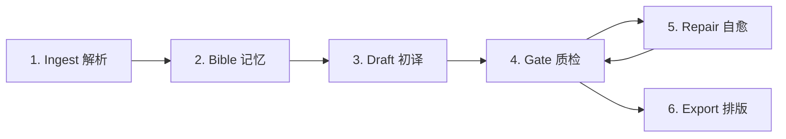
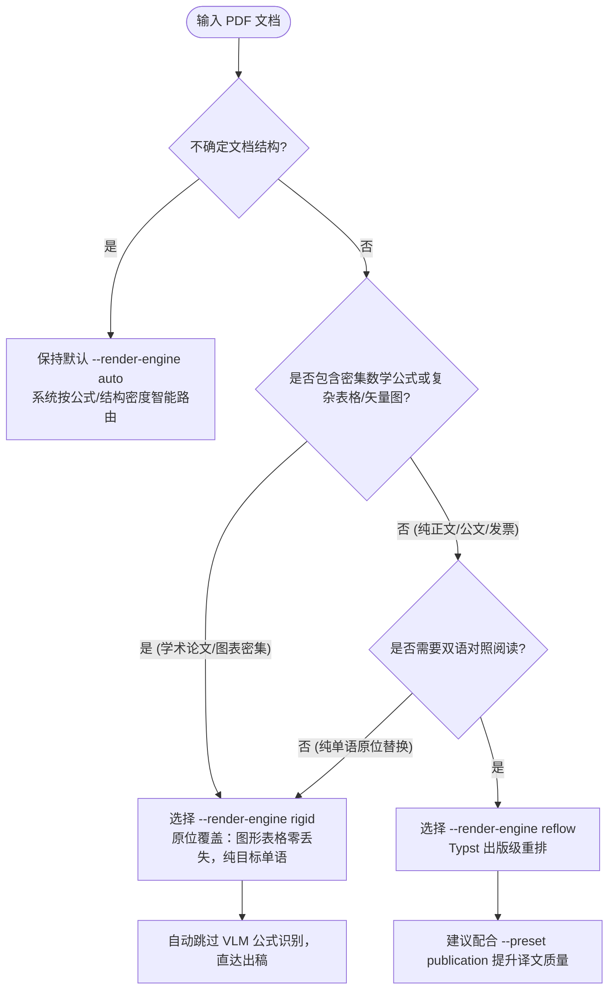

# Universal Book Translator (UBT) 用户指南与参考手册

本文档提供 `universal_book_translator` (UBT) 项目的完整使用指南，涵盖核心架构原理解析、排版引擎决策树、三重自愈系统、交互向导、CLI 完整命令集、配置字典、服务端/智能体接口及典型生产实践。

---

## 目录
- [一、 快速上手：三种推荐使用方式](#一-快速上手三种推荐使用方式)
- [二、 核心架构与六阶段生命周期详解](#二-核心架构与六阶段生命周期详解)
  - [1. 六阶段流水线流转](#1-六阶段流水线流转)
  - [2. SQLite WAL 账本与断点续跑机制](#2-sqlite-wal-账本与断点续跑机制)
  - [3. 块状态机 (IRBlock Lifecycle)](#3-块状态机-irblock-lifecycle)
- [三、 排版引擎选型与决策指南 (Decision Tree)](#三-排版引擎选型与决策指南-decision-tree)
  - [1. 物理排版引擎对比：Reflow vs Rigid](#1-物理排版引擎对比reflow-vs-rigid)
  - [2. 引擎选型决策树](#2-引擎选型决策树)
  - [3. 双语对照模式与版面形态](#3-双语对照模式与版面形态)
- [四、 三重自愈系统机制 (Triple-Loop Self-Healing)](#四-三重自愈系统机制-triple-loop-self-healing)
  - [1. 译文缺陷微创修补 (MQM Span Splicer)](#1-译文缺陷微创修补-mqm-span-splicer)
  - [2. 编译器诊断自愈 (Typst Diagnostic Healer)](#2-编译器诊断自愈-typst-diagnostic-healer)
  - [3. 视觉门禁排版自愈 (Visual-Gate Reflow Loop)](#3-视觉门禁排版自愈-visual-gate-reflow-loop)
  - [4. 人机协作隔离队列 (HITL PE Queue)](#4-人机协作隔离队列-hitl-pe-queue)
- [五、 命令行 (CLI) 完整命令与参数手册](#五-命令行-cli-完整命令与参数手册)
  - [1. ubt doctor (环境与凭据检查)](#1-ubt-doctor)
  - [2. ubt assess (译前报价与体检)](#2-ubt-assess)
  - [3. ubt translate (核心翻译排版)](#3-ubt-translate)
  - [4. ubt tui (交互向导与快捷键)](#4-ubt-tui)
  - [5. ubt inspect (结构与状态检查)](#5-ubt-inspect)
  - [6. ubt status (作业账本查询)](#6-ubt-status)
  - [7. ubt pe-import (人工审校回灌)](#7-ubt-pe-import)
  - [8. ubt worker (后台工作进程)](#8-ubt-worker)
  - [9. ubt version (版本信息)](#9-ubt-version)
  - [10. ubt metrics (KPI 度量与回归比对门禁)](#10-ubt-metrics)
  - [11. ubt config (配置字段权威清单)](#11-ubt-config)
  - [12. ubt recheck-gates (隔离块质检复跑)](#12-ubt-recheck-gates)
  - [13. ubt api (服务端入口别名)](#13-ubt-api)
- [六、 全局环境变量与配置字典 (UBTConfig)](#六-全局环境变量与配置字典-ubtconfig)
- [七、 服务端与智能体服务](#七-服务端与智能体服务)
  - [1. ubt-api (FastAPI REST/SSE)](#1-ubt-api)
  - [2. ubt-mcp (MCP 智能体工具协议)](#2-ubt-mcp)
- [八、 辅助脚本库 (scripts/ 目录)](#八-辅助脚本库-scripts-目录)
- [九、 典型场景最佳实践命令范例](#九-典型场景最佳实践命令范例)
- [十、 扩展：挂载自定义适配器与 PDF 引擎](#十-扩展挂载自定义适配器与-pdf-引擎)

---

## 一、 快速上手：三种推荐使用方式

系统原生支持 **PDF, EPUB, DOCX, Markdown (`.md`/`.markdown`), HTML (`.html`/`.htm`), TXT** 全格式文档输入（权威清单以 `ubt.adapters.factory.supported_suffixes()` 为准），并内置跨格式通用的 **自适应短/长链智能路由**（按各载体可用特征——Token 容量预算、章回结构层级、born-digital/扫描载体约束——全自动决策单兵极速链路或全书长链）。

| 场景 | 推荐入口 | 核心优势 |
| :--- | :--- | :--- |
| **日常使用 / 人工交互** | `uv run ubt tui <file>` 或 `uv run ubt translate <file> -i` | **最推荐**。自动探测文档类型、公式密度、版面特征并推荐最佳排版策略，可视化实时监控。 |
| **自动化 / 批处理脚本** | `uv run ubt translate <file> [options]` | 原生断点续跑、并发限流、质量评估闭环（QE）、Pre-flight 诊断预警、SQLite 账本存储。 |
| **微服务 / 智能体集成** | `uv run ubt-api` 或 `uv run ubt-mcp` | 提供标准异步 REST 接口、SSE 实时事件流推送，或接入 Cursor/Claude 智能体。 |

---

## 二、 核心架构与六阶段生命周期详解

UBT 摒弃了简单粗暴的单次 Prompt 翻译，构建了严格受状态机保护的六阶段（6-Stage）工业级流水线：



### 1. 六阶段流水线流转
1. **Stage 1: Ingest（全格式解析入库）**
   - 多格式统一转换为中间表达（`DocumentIR`）；
   - PDF 解析双引擎智能路由：纯文本快速解析走 `PDFium`，多栏复杂版面走 `IBM Docling`；页面光栅与纯文本兜底提取由基础依赖 `pdf-oxide` 进程内完成（无 poppler `pdftoppm` 等系统二进制）；
   - 提取段落、数学公式、表格、图表矢量区域并生成唯一稳定的 `FlowID`。
2. **Stage 2: Bible & Memory（术语提炼与记忆唤醒）**
   - 全书扫描提炼专有名词、核心术语、主要人物与缩略词，构建本任务“术语圣经”；
   - 检索全局翻译记忆库（`tm.sqlite`）进行精确或模糊匹配（默认阈值 0.85）；
   - 激活分层记忆网络（L1 邻块微上下文滑窗、L2 宏步进快照、L3 epoch 摘要；跨章节滚动摘要是独立于 L3 的另一特性，由 `--rolling-summary` 控制）。
3. **Stage 3: Draft（分块初译批处理与性能优化）**
   - 按照 Token 容量与并发限流桶（Adaptive Token Bucket）并发发起模型请求；
   - **宏块合并打包（Macro-Chunking）**：支持将连续的多个 micro-block（如 5~10 块，通过 `--macro-chunk-size` 控制）打包合并为单次 LLM 请求，彻底消除微块重复发送静态提示词的前缀开销与往返网络延迟，长文档初译提速可达 3~5 倍，Token 消耗节省 70%~80%；
   - **供应商 Prompt Caching**：提示词装配严格遵循静态前缀（Static Prefix），最大化利用供应商的 Prompt Caching 降低开销；
   - **离线批处理（Cloud Batch API）**：支持 `--offline-batch` 切换至云端异步批处理通道；折扣仅在 **OpenAI 兼容的 chat/completions Batch 线路**（`api_mode="chat"`）上实现——Responses API 与其他网关不支持，会回退交互全价并在 assess 报告中以 `BATCH_DISCOUNT_UNAVAILABLE` 披露（无 Anthropic Messages Batches 实现）；
   - **跨章节异步流式（Chapter Streaming）**：通过 `--chapter-streaming` 打破整书同步屏障，各章节按流水线解耦推进；
   - 保护性标记处理：数学公式遮罩（`⟦MATH_MASK_0001-a3f⟧` 式带校验和的 token，多个 masker 各有命名空间）、代码块、专有引用。
4. **Stage 4: Quality Gate（质量门禁检查）**
   - **0-Token 极速启发式检查**：长度比校验、双语标点拓扑映射、数字集合绝对一致性；
   - **四重数学公式防线**：检查行内行间公式是否有漏译、被篡改或语法破损；
   - **高级评估（可选）**：支持基于 COMET-Kiwi 的神经网络打分与分层 LLM-as-Judge 评审。
5. **Stage 5: Repair & Triage（自愈修复与分流）**
   - 未通过门禁的块进入自愈回路，最多重试 2 轮；
   - 优先采用 **跨度级微创修补（Span Splicer）**，无需重新生成整个段落；
   - 依然严重超标的顽固问题，标记为 `blocked_human` 放入隔离队列，防止瑕疵品流入成品。
6. **Stage 6: Export & Typesetting（排版编译与组装）**
   - 装配目标文档：EPUB 按源文件 OPF 版本原样重打包（不强制升级 3.0）；
   - PDF 走 **Typst 全局流式重排** 或 **原位底板覆盖**；
   - 启动 **TypstHealer 语法自愈引擎** 兜底，输出最终高保真交付文件。

### 2. SQLite WAL 账本与断点续跑机制
- 每个翻译任务在 `.ubt/ledgers/<job_id>.sqlite` 拥有独立的 SQLite 数据库文件；
- 全程开启 **WAL (Write-Ahead Logging)** 模式，读写完全解耦，支持高并发安全写入；
- **崩溃安全保证**：翻译过程中即刻落盘。无论断电、Ctrl+C 中断还是网络超时，重新运行命令时，系统自动扫描账本恢复状态，跳过已完成块，零重复计费。
- **解析产物缓存（`.ubt/`）**：账本只在"已有块"时跳过解析，所以 `--fresh`、同一本书换目标语言另起 job、或崩在 ingest 中途都会**重新解析**一遍。对公式密集的学术 PDF，解析里的 VLM 公式转写是绝对大头（26 页章节实测 759 s / 769 s），因此两类解析产物会按内容落盘复用：
  - `.ubt/profile_cache/`：页级版式探测结果，键为（绝对路径 + 大小 + mtime）；
  - `.ubt/docling_cache/`：Docling 整篇版面转换结果，键为（文件 SHA256 + 页范围 + 完整 pipeline 选项 + Docling 版本），单条 gzip 后约几十 KB；
  - `.ubt/docling_cache/assets/<SHA256>/`：从源 PDF 抽出的图片资产（`pic_p*.png`）。账本里 IMAGE 块记录的就是这些路径，因此它们必须与转换缓存同生共死：早期版本写在系统临时目录（`/tmp/ubt_assets/`），重启即丢图、且无人清理；现在删除 `.ubt/docling_cache/` 会连同图片一起回收，续跑也不会再断链。
  以上都只是缓存，不参与正确性判定：任一输入变化即自动失效，读到损坏条目会当作未命中重跑。想强制重新解析（例如升级了版式模型但版本号没变），直接删除对应目录即可。

### 3. 块状态机 (IRBlock Lifecycle)
每个文本/公式/表格块在账本中严格遵循以下状态变迁：
```text
PENDING (待处理)
   │
   ▼
DRAFTED (已初译)
   │
   ▼
MTQE_PASSED (质检及格) ──────► (进入导出/排版)
   │ (质检瑕疵)
   ▼
REPAIR_PENDING (待修复)
   │
   ▼
REPAIRED (已局部修复) ───────► (进入导出/排版)
   │ (修复轮数耗尽仍不合格)
   ▼
BLOCKED_HUMAN / NEEDS_HUMAN (隔离入人工队列)

失败旁路：任一步不可恢复 → FAILED
```

（状态全集以 `ubt/core/ir/models.py` 的 `BlockStatus` 为准：`PENDING / DRAFTED / MTQE_PASSED /
REPAIR_PENDING / REPAIRED / FAILED / NEEDS_HUMAN / BLOCKED_HUMAN`。没有 `READY` 状态。）

---

## 三、 排版引擎选型与决策指南 (Decision Tree)

### 1. 物理排版引擎对比：Reflow vs Rigid

| 对比维度 | Reflow（流式学术重排） | Rigid（原位底板覆盖） |
| :--- | :--- | :--- |
| **底层技术** | 现代矢量排版编译器 **Typst** | 原始 PDF 矢量图元原位打标 |
| **排版原理** | 从零生成全新流式页面，重新计算分栏、段间距、行距与字间距 | 保留原版 PDF 页面为底板，将译文按原边框覆盖回填 |
| **字体呈现** | 学术衬线宋体（`Noto Serif CJK SC`），西文回退罗马体 | 尽可能贴近原版字号（容易因字宽不一致触发压缩变形） |
| **公式表现** | MathJax 重新编译为矢量居中公式，自动编号，高保真 | 复用原版底板公式切片，零识别幻觉，但无法重新流式排列 |
| **双语支持** | 完整支持 `inline`（段落交替）、`alternating`（整页交替）、`facing`（对开对展）、`monolingual` | 仅支持 `monolingual`（单语替换原位） |
| **适用场景** | 学术专著、科技论文、公式密集型教材、出版物输出 | 纯文字政府公文、合同、商业发票、扁平单据、快速审阅草稿 |

### 2. 引擎选型决策树



> **为什么公式/表格密集文档走 rigid？** reflow 的产物质量完全受限于结构抽取——多级表头会被打碎成单字单元格、TikZ/matplotlib 矢量图会整幅丢失（实测 arXiv 2609.20519：6 图丢 4、Table 1 不可用）。rigid 以源页为底板，几何、图形、公式**物理上不可能被重排破坏**，代价是仅支持单语输出、译文受原框尺寸约束。

### 3. 双语对照模式与版面形态
通过 `--dual-mode` 参数控制：
- **`inline`（段落交替对照）**：在每个英文原段落下方插入对应中文翻译段落，并应用细微样式区分（`reflow` 引擎支持）；
- **`facing`（学术对开跨页对照）**：生成印刷专著级排版，偶数页（左页）显示英文原版，奇数页（右页）显示对应中文译文，页面自动对齐；
- **`alternating`（整页交替对照）**：第 1 页英文、第 2 页中文、第 3 页英文交替出现；
- **`monolingual`（纯中文单语模式）**：过滤掉英文原文，直接输出符合学术规范的纯中文终稿。

---

## 四、 三重自愈系统机制 (Triple-Loop Self-Healing)

三条自愈环分别覆盖**译文质量**（1、2）与**排版质量**（3）；第 4 节不是环，是三条环都救不回来之后的出口。

### 1. 译文缺陷微创修补 (MQM Span Splicer)
传统方案在质检失败后往往要求模型“整段重新翻译”，极易引发新的幻觉，且浪费 80% 以上不必要的 Token。
- **微创原理**：系统基于 MQM 缺陷分类，精确锁定译文中有瑕疵的局部跨度（Span，例如某处年份从 `1998` 错译成了 `1989`，或术语未对齐）；
- **局部缝合**：仅将问题原词及前后微上下文送入 Repair 提示词，由大模型产出微切片后，算法自动在内存中精准替换原译文对应区间。

### 2. 编译器诊断自愈 (Typst Diagnostic Healer)
由于大模型输出的不确定性，翻译包含 LaTeX 数学符号或代码的段落时，编译为 Typst 可能会偶发语法错误。
- **拦截诊断**：引擎捕获 Typst 编译器的标准错误输出，解析具体报错行号与错误类型（如 `unclosed delimiter`, `expected identifier`, `invalid escape`）；
- **规则修补器**：内置多组抽象语法树（AST）正则修复规则，自动补齐未闭合的括号、修复非法的反斜杠转义、规范表格分界符，随后重新触发编译；
- **最终降级保护**：若单块多次尝试仍无法编译，系统将自动回退为该块的原始安全文本或见证源图，确保**整本书排版绝不崩溃挂起**。

### 3. 视觉门禁排版自愈 (Visual-Gate Reflow Loop)
前两条环修的是**内容**（译文、编译），这一条修的是**成品版面**（`ubt/core/engine/reflow_loop.py`）：
- **渲染后度量**：Stage 6 产出 PDF 后，视觉门禁（T0/T1/T2）核对页数、图像数、目标语覆盖率等破坏性缺陷——这类缺陷单看编译成功与否发现不了；
- **首轮自救**：检出 major/critical 缺陷时先做一轮排版微调（字号 92%、行距 0.75em）并重新渲染；`rigid` 引擎显式排除在外（它按源版面几何排版，重渲染不会改变任何字形，只会白烧一次渲染）；
- **修不好就隔离**：缺陷仍在时，受影响的页面块标记 `NEEDS_HUMAN`（附 `visual_gate_failed` 标志），`visual_report.json` 落盘到产物目录与 SQLite 账本，缺陷成品不会静默出门。

### 4. 人机协作隔离队列 (HITL PE Queue)
对于经过最大修复轮数（默认 2 轮）依然无法消除严重质量缺陷的块：
- 系统将其状态标记为 `BLOCKED_HUMAN`；
- 该块被立即从机器交付成品中隔离，防止带毒输出；
- 用户可通过 `ubt status` 发现阻断块，并使用 `ubt pe-import` 导入人工修正。

---

## 五、 命令行 (CLI) 完整命令与参数手册

CLI 顶层命令为 `ubt`。

### 1. `ubt doctor`
在首次安装或排查故障时运行，执行全套离线自检：
```bash
uv run ubt doctor
```
- **检查项目**：
  - 凭据配置状态（`UBT_LLM_API_KEY` / `OPENAI_API_KEY`）；
  - 账本目录（`.ubt/ledgers`）读写权限；
  - 共享翻译记忆库（`tm.sqlite`）状态；
  - 渲染工具链：Typst 编译器、Poppler 文本/矢量工具（`pdftotext`、`pdftocairo`）、Pillow 图像库、CJK 中文字体（Noto Serif CJK SC / Noto Sans CJK SC）。页面光栅不再依赖 poppler `pdftoppm`——已由基础依赖 pdf-oxide 进程内完成。

---

### 2. `ubt assess`
译前报价与体检：零 LLM token、零账本写入，先回答「这本书值不值得花这个钱、会走哪条路线、有什么坑」，再决定是否开跑：
```bash
uv run ubt assess <input_path> [--preset P] [--provider-profile X] [-l zh] [-s en] [--deep] [--json]
```
- **报告内容**：文档判型（品类/领域/数学密度/扫描占比/文本层覆盖率）、推荐路线（short/long 链路 + 推荐 preset/渲染引擎/双语模式/领域档案 + 路由置信度）、预期成本明细（Draft 实测前缀 Token + 宏块合并折算 + 修复/QE/视觉/滚动摘要的配置化外推）、启发式耗时区间、稳定机读警告码。
- **两条红线**：
  - **不预测质量分数**——MTQE 只存在于译文之上，报告只给路由置信度与已知损伤信号；
  - **费用为「预期非保证」**——fan-out 按配置上限与平均缺陷率外推；模型无价格表条目时费用呈现为「未知」，绝非 $0（`MODEL_UNPRICED`）。
- **核算模型与计算精度**：
  - **宏块合并折算（Macro-Chunking）**：系统根据配置的 `macro_chunk_size` 自动折算合并调用后的前缀开销（公式：$\lceil \text{billable\_blocks} / \text{macro\_chunk\_size} \rceil \times \text{prefix\_tokens} + \text{source\_tokens}$），真实反映批量打包对静态提示词的开销压缩；开启离线批处理时自动计入 50% Batch API 折扣；
  - **扫描件 OCR 真实容量预估**：纯扫描 PDF 自动按每页 `EXPECTED_SCANNED_PAGE_CHARS = 1200` 预估 OCR 提取容量与 Draft 费用，彻底消除虚假 **$0.0000** 报价，并触发 `SCANNED_PAGE_OCR_ESTIMATED` 警示；
  - **多章节流水线校准**：长文档 PDF 按切片规则计算真实章节数 `pdf_chapters = 1`（页数 ≤ `short_max_pages` 时）`else max(1, pages // 20)`，精准外推 Bible 抽取与 Rollup 滚动摘要的跨章耗时与 Token 开销；
  - **深度模式精确过滤**：`--deep` 跑真实解析时严格过滤 `skip_translate`、`FORMULA`（数学公式）与 `IMAGE`（图表）块，确保计费块数与运行时账本字节级对齐；默认浅扫描模式采用校准基准段落密度 `APPROX_BLOCK_CHARS = 350`；
  - **辅助模型与质检拆解**：视觉审查独立读取 `visual_judge_model` 定价；QE 质检按精简评判 Prompt（~250 token）核算；当 `max_repair_rounds == 0` 时精确置零修复成本；
  - **分项金额严格对齐**：`CostQuote.rollup_cost_usd` 显式拆解滚动摘要费用，终端表格各行分项之和严格等于总费用（Total Cost）；
  - **预设策略透明度**：报告明确标注文档是基于显式 `--preset` 还是默认标准策略生成的评估。
- **排版推荐与警告码**：
  - **路线推荐规则**：公式/图表密集或学术专著推荐 `rigid`（原版位物理保真）+ `monolingual`（单语替换），彻底保护图表和多级表格（对标 arXiv 2609.20519）；纯文字或叙事通俗读物推荐 `reflow`（Typst 全局重排）+ `inline`（段落交替双语）；
  - **警告码**：`SCANNED_PAGES_DOMINANT`（扫描页主导）、`SCANNED_PAGE_OCR_ESTIMATED`（扫描件已按 OCR 预期容量估价）、`FONT_RESIDUE_RISK`（字体编码损伤，部分文字可能不可恢复）、`MODEL_UNPRICED`（模型未收录价表，呈现为未知）、`OVERLAY_CONFLICT`（rigid 原版位引擎只支持单语，使用双语模式存在版面重叠风险）、`FORMULA_HEAVY_NEEDS_ENRICHMENT`（公式密集但增强已关，preview 预设常见取舍）、`PATHOLOGICAL_PAGE_RISK`（超大矩形页数页，几何分析 O(n²) 可能极慢）、`PAGES_SLICE_QUOTED_WHOLE`（带 `--pages` 切片但报价按全书计）、`BATCH_DISCOUNT_APPLIED` / `BATCH_DISCOUNT_UNAVAILABLE`（离线批折扣已计入 / 该线路无折扣）、`PREFIX_UNMEASURED`（静态前缀未能实测，按估算折算）、`DEEP_INGEST_FAILED`（`--deep` 真实解析失败，已回退浅扫描）；降级类 `*_UNAVAILABLE` 表示某一探测环节失败、已按可用信息出报告。
- **异常拦截与鲁棒性**：面对 0 字节损坏文件自动拦截并返回 `EMPTY_FILE`；面对带密码加密 PDF 自动拦截并返回 `ENCRYPTED`；底层探测全面接入线程池异步化，大文档评估绝不阻塞主事件循环。
- **退出码**：`0` 出报告 / `1` 文件不存在、空文件、加密或格式不支持 / `2` 配置非法（与 `doctor` 同契约）。`--json` 时 stdout 恰好一个 JSON 对象（失败也是单对象 `{"status":"error","code":...}`）。
- 报告末尾附**照抄即用**的 `ubt translate` 命令（自动拼接推荐的 `--render-engine` 与 `--dual-mode`，含派生 `--job-id`），确认报价后直接复制即可开跑。

---

### 3. `ubt translate`
书籍与学术文献翻译排版的核心命令：
```bash
uv run ubt translate <input_path> [OPTIONS]
```

#### ① 输入输出与元数据
- `input_path` (`Path`，必填)：输入书籍或文档路径，支持 `.pdf`, `.epub`, `.docx`, `.md`, `.markdown`, `.html`, `.htm`, `.txt`。
  - **Markdown 提示**：解析器把表格行按普通叙事段落送入翻译模型，双语交错会把表格复制为两段文本。含表格的技术书籍请改走 HTML 或 PDF 路径（标签级注入会保留表格结构）；纯叙事型 Markdown 不受影响。
- `-o, --output` (`Path`，默认：`$UBT_OUTPUT_DIR/<stem>_bilingual<suffix>`；`UBT_OUTPUT_DIR` 默认 `<文档目录>/UBT`)：目标输出译本路径。
- `-s, --source-lang` (`str`，默认：`"en"`)：源语言代码。
- `-l, --target-lang` (`str`，默认：`"zh"`)：目标翻译语言代码。
- `-p, --profile, --domain-profile` (`str`，默认：`"general"`)：翻译领域画像，可选 `general`（通用）、`textbook`（教科书）、`paper`（学术论文）、`fiction`（文学小说）、`humanities`（人文社科）、`technical`（计算机与工程技术）。`--domain-profile` 为 `--profile` 的完整长参数别名。
- `--domain` (`str`，默认：`None`)：细分专业领域描述（如 `"semiconductor device physics"`）。
- `-g, --glossary` (`Path`，默认：`None`)：用户外部术语表文件路径（支持 `.csv`, `.tsv`, `.json`）。

#### ② 预设档位与模型控制
- `--preset` (`Enum`，默认：`None`)：工业级质量档位预设（显式参数优先于预设）。**preset 只管"翻译投入多少质量"（提示词深度、术语圣经、公式处理），不再绑定排版路线**——路线由 `--render-engine` 独立决定（2026-09-20 起；此前 `publication` 会强制 `reflow`，对图表密集型论文是系统性错误）：
  - `publication`（出版级）：全套高保真术语圣经 + 丰富上下文提示，对标正式出版物印刷交付。**执行链路解耦采用 `exec_mode="auto"` 智能路由**（短文档走自适应短链，长文档走分章长链）。
  - `standard`（标准）：自动短/长链路由，平衡质量与翻译速度。
  - `preview`（快速预览）：公式跳过神经识别直接使用源图切片，精简提示词，极速出成果。
  - `fast`（极速论文）：零重型依赖、轻量几何抽取，**强制短链**（`exec_mode="short"`）+ 最小提示词 + 公式源图保真（`formula_render=image`，跳过重新识别）。仅适合扫读大意；短链下术语圣经退化为 fast-lane seed（不整书提炼），正式交付勿用。
- `-m, --draft-model, --model` (`str`，默认：`"muse-spark-1.3-contributor"`)：初译阶段调用的 LLM 模型。默认值是作者的基准测试目标模型，几乎不是你的凭据能调用的模型——请用 `--draft-model` 或 profile 显式指定。
- `--repair-model` (`str`，默认：与 `draft_model` 相同)：质量未及格块的修复模型。
- `--prompt-strategy` (`Enum`，默认：`"auto"`)：提示词装配策略，可选 `auto`、`minimal`、`hybrid`、`rich`。
- `--api-key` / `--base-url` / `--api-mode` / `--provider-profile` (`str`)：凭据三元组与 profile 选择，语义同第六节（命令行传密钥会进 shell 历史并对本机 `ps` 可见，仅限一次性覆盖）。
- `--db-dir` (`Path`，默认：跟随配置链 `UBT_DB_DIR`/`ubt.toml`)：本命令读写的账本目录。不传时**不是**硬编码 `.ubt/ledgers`，而是走配置链——显式注入字面默认会把账本放在别处的作业报成"不存在"。
- `--dry-run` (`bool`，默认：`False`)：本地模拟演练模式，使用内置模拟引擎，零外部 API 消耗。

#### ③ 执行链路与全格式自适应智能路由
- `--mode, --exec-mode` (`Enum`，默认：`"auto"`)：执行流水线路由：
  - `auto`：**全格式自适应短/长链路由**。综合 Token 预算、章回结构、born-digital/扫描状态全自动决策；
  - `short`：强制走短链（单兵整章快速改写 + 视觉门禁）；
  - `long`：强制走 6 阶段长链（完整全局术语圣经 + 跨章进度断点续跑）。
- `--short-max-pages` (`int`，默认：`30`)：判定短文档的页数/Token 折算上限。
- `--pages, --page-range` (`str`，默认：`None`)：PDF 页码切片处理（例如 `"1-5"`, `"1,3,5"`, `"10-20"`）。
- `--start-chapter` (`int`，默认：`1`)：起始章节序号（1-based）。
- `--max-chapters` (`int`，默认：`None`)：最大处理章节数。
- `--rolling-summary / --no-rolling-summary` (`bool`，默认：`True`)：是否启用跨章节滚动剧情/学术摘要。
- `--fresh` (`bool`，默认：`False`)：清除历史作业账本记录并从头重新解析入库（默认采用断点续跑）。
- `--job-id` (`str`，默认：`None`)：显式指定作业唯一标识（仅支持字母/数字/-/_）。

#### ④ 并发、性能与质量控制 (QE)
- `-c, --concurrency` (`int`，默认：`10`)：大模型请求最大并发数（短链模式下全并发跑满）。
- `-b, --batch-limit` (`int`，默认：`30`)：账本分页读取块批次大小。
- `--macro-chunk-size` (`int`，默认：`1`)：每次 LLM 请求打包的连续 micro-block 数（长文档标准推荐 `5`~`10`，1 为逐块请求）。用于超长文档的极速批量初译，大幅降低 70%~80% 的静态提示词前缀 Token 开销并消除往返网络延时。
- `--chapter-streaming / --no-chapter-streaming` (`bool`，默认：`False`)：跨章节异步流式流水线通道。启用后打破整书章节间的串行同步屏障，各章节按阶段重叠推进，成倍缩减长篇图书端到端耗时。
- `--offline-batch / --no-offline-batch` (`bool`，默认：`False`)：通过云端 Batch API（仅 **OpenAI 兼容 chat/completions 线路**，`api_mode="chat"`）异步批量翻译整书，账单约五折；Responses/其他网关不支持时回退交互全价（assess 会发 `BATCH_DISCOUNT_UNAVAILABLE`），适合非即时交付的大规模图书翻译。
- `--budget-usd` (`float`，默认：`None`)：单个作业的美元硬预算上限（跨多次续跑累计）。开跑前若最便宜的预估值已超预算，将在 0 token 处直接拒跑；运行时累计超额立即安全停止并完整保留账本进度。
- `--qe-engine` (`Enum`，默认：`"heuristic"`)：质量评估引擎：
  - `heuristic`：0 Token 极速规则评估（长度比、标点、数字一致性）；
  - `subprocess`：外部 CometKiwi 神经网络评分隔离子进程打分（需 `uv sync --extra qe` 与模型权重；`comet`/`cometkiwi`/`neural` 是其历史别名，配置时归一并提示。注意 COMET-Kiwi 权重为 CC-BY-NC-SA 非商用许可，只用于校准与报告，不作商业交付门禁）；
  - `tiered`：分层评估（灰度带使用 LLM-as-Judge 复核；需显式 `UBT_QE_JUDGE_ENABLED=true`，不再静默开启）。
- `--visual-judge / --no-visual-judge` (`bool`，默认：`False`)：把抽样后的**渲染成品页**发给视觉 LLM 评审（T2 档），产出版面重叠/截断/乱码判词；默认关（花费 token）。开启与否都不影响交付拦截：页数/图像数漂移、目标语覆盖率等破坏性 parity major 一律 fail-closed 阻断导出。
- `--visual-judge-model` (`str`，默认：`None`)：视觉评审使用的多模态模型（缺省取供应商 profile 的视觉档位）。
- `--strict` (`bool`，默认：`False`)：CI/CD 自动化门禁模式。以下任一情形以非零退出码（exit code 1）退出：存在失败块（`failed_blocks`）、待人工块（`needs_human_blocks`）、严重阻断块（`blocked_human_blocks`）、渲染期 fail-closed 被跳过而把源文留在页面上的块（`render_coverage.skipped_blocks`）；质量报告**不可读或形状异常本身也算失败**（无法核验完整性即拒绝发货）。

**质量报告副产物（quality report artifacts）**：作业走到导出阶段、构建质量报告时，会在成品文件同目录写出同源副产物（命名见 `sidecar_path`：`<输出名>_<格式标签>_quality_report.<ext>`，如 `book_bilingual.md` → `book_bilingual_md_quality_report.json`）：

- `*_quality_report.json`：机器可读的质量汇总，**默认写出**。`--strict` 门禁核验的就是这份 JSON 的完整性，`ubt metrics`/KPI 派生指标与状态路径查找也读它。
- `*_quality_report.md`：**Amazon KDP 交付自查声明（可选副产物）**。用与 JSON 完全相同的指标、经固定模板渲染的 Markdown：KDP AI 内容披露声明、通过率与阈值判定、失败/待人工块清单、渲染覆盖、术语一致性与公式/占位符保真、多层修复分层等章节。面向人工审阅——上架 KDP 前据此自查 AI 参与度披露与质量阈值是否达标，可直接作为随书交付的合规附件。

生成时机与开关：JSON 由 `save_quality_report` **默认**写出；Markdown 是**显式 opt-in**——默认关闭，设置环境变量 `UBT_KDP_AUDIT_MARKDOWN=1`（即 `UBTConfig.kdp_audit_markdown`）才会额外落盘。它是人工审阅件而非机器契约，且陈旧报告清扫只认识 JSON/KPI/visual 三种副产物。每次（重新）导出都会覆盖同名副产物。

#### ⑤ 排版引擎与字体控制
- `--render-engine` (`Enum`，默认：`"auto"`)：渲染排版物理引擎：
  - `auto`（**智能路由，引擎底层默认**）：按文档结构密度分派——含数学公式或公式/表格/图/代码块占比 ≥20% 的文档走 `rigid`（保真优先），纯正文文档走 `reflow`（排版更美）；若全篇无可信几何（解析落到纯文本兜底腿），auto 强制改走 reflow 并给出提示。不确定文档结构时保持此值即可。
  - `reflow`（**出版级流式重排**）：基于 Typst 从零生成连续学术排版，支持原生学术宋体、行内/行间公式 MathJax 矢量居中自动编号及对开双语对照，配合版面重叠检测杜绝文字重合。适合正文主导、结构抽取可靠的文档；表格密集或矢量图论文慎用（见决策树说明）。
  - `rigid`（**原位覆盖模式**）：以原版 PDF 页面为底板，正文原位填入原框（纯目标单语输出；与 `--dual-mode` 的非单语值冲突时 CLI 启动即警告、渲染期自动降级为 monolingual）。**适用场景**：学术论文、图表密集文档、以及一切"结构抽取不可信"的 PDF。
  - 显式指定的引擎与 auto 判定分歧时（如强制 reflow 跑结构密集文档），渲染前会打印一条警告并给出重跑建议——强制是允许的，但必须知情。
- `--dual-mode` (`Enum`，默认：`"inline"`)：双语排版模式（`inline`, `alternating`, `facing`, `monolingual`, `auto`）。
- `--facing-spread / --no-facing-spread` (`bool`，默认：`False`)：对开排版时补齐衬页保证对齐。
- `--emit-both / --no-emit-both` (`bool`，默认：`False`)：同时输出双语版和纯单语版两个成品。
- `--translate-chrome / --no-translate-chrome` (`bool`，默认：`False`)：是否翻译页眉页脚（默认不翻译以保护结构元信息）。
- `--cover-mode` (`Enum`，默认：`"auto"`)：封面渲染策略（`auto`, `always`, `never`）。

#### ⑥ 公式与 OCR 控制
- `--formula-mode` (`Enum`，默认：`"readable"`)：短链公式策略：`readable`（Unicode 近似改写，可读性优先）或 `strict`（公式字节级一致四道门全开，零容忍）。
- `--formula-enrichment` (`Enum`，默认：`"auto"`)：Docling 视觉公式识别策略（`auto`, `on`, `off`）。`auto` 下 `rigid` 渲染或 `formula_render=image` 会自动跳过 VLM 数学识别（源版面公式原样保留，无需重识别）。
- `--formula-render` (`Enum`，默认：`"witness"`)：公式保真策略：`witness`（视觉见证比对，异常自动回退源图）、`image`（全量源图）、`native`（纯语法重排）。
- `--math-backend` (`Enum`，默认：`"mathjax"`)：公式渲染后端：`mathjax`（矢量 SVG）、`image`（原图切片）、`typst`（原生 Typst 语法）。
- `--ocr` (`Enum`，默认：`"auto"`)：OCR 模式（`auto`, `sidecar`, `cloud`, `vlm`, `rapidocr`, `off`）。`auto` 的实际探测顺序为：本地/sidecar → 本地 rapidocr → 云端 cloud/vlm（最后手段，受 `UBT_ALLOW_PAGE_UPLOAD` 约束）；显式指定 `cloud`/`vlm` 而 `UBT_ALLOW_PAGE_UPLOAD=false` 时直接报错拒跑。
- `--ocr-endpoint` (`str`，默认：`None`)：OCR 服务端点 URL（本地 sidecar 默认探测 `http://localhost:8765`，或云端 OpenAI 兼容 vision 端点）。
- `--ocr-api-key` (`str`，默认：`None`)：云端 Cloud OCR 或视觉 LLM 的 API 密钥（亦可用 `UBT_OCR_API_KEY`）。

#### ⑦ 交互与格式输出
- `-i, --interactive` (`bool`，默认：`False`)：直接启动 TUI 交互向导。
- `--json` (`bool`，默认：`False`)：纯 JSON 机器输出模式（用于管道集成，关闭终端样式）。
- `-v, --verbose` (`bool`，默认：`False`)：在 stderr 中输出 DEBUG 调试日志。

---

### 4. `ubt tui`
启动基于 Textual 的全屏沉浸式终端向导：
```bash
uv run ubt tui [file_path] [--dry-run]
```
- **核心界面与交互**：
  - **文档预检卡片**：扫描并展示篇幅与章节规模、文本类型、公式密度、领域与术语表情况、运行环境（GPU / Typst / API 密钥是否就绪）与预计路由，并据此给出档位建议（建议仅供参考——只有你主动选定档位后，该档的引擎参数才会生效）；
  - **三栏式监控控制台**：
    - 左栏：当前文件与历史任务（账本）列表，配阶段步进器；
    - 中栏：事件流，以及当前块的实时双语比对预览卡片；
    - 右栏：翻译形态、平均质量分与末位 15% 分位、完成/修复/失败块数、累计花费（USD）、耗时与均速；缓存命中率与质量趋势不在这一栏，用 `/report` 查看；
- **键盘快捷键**：
  - 全局：`?` 帮助面板；`Tab` / `Shift+Tab` 在各面板与控件间切换焦点；`Ctrl+Q`（或 `Ctrl+C`）安全退出；
  - 向导页：`1` / `2` / `3` 选质量档（出版级 / 标准 / 预览）；`b` / `f` / `m` 切换行内双语 / 左右对照 / 纯单语；`p` 预检当前文档；`d` 切换演练模式；`r` 切换重译模式；`Ctrl+P` 聚焦路径输入；
  - 运行页：`/` 打开命令行；`Ctrl+K` 命令面板；`r` 重试失败块；`o` 打开产物；`d` 查看质量报告；`m` 切换双语 / 单语；`Esc` 返回向导；
  - 流水线没有"暂停/恢复"单键：`/cancel` 立即终止当前运行——账本已落盘的进度不丢，之后重开向导选中同一作业即可断点续跑（已译块零重复计费）。

---

### 5. `ubt inspect`
查看文档章节结构、Token 规模或查询已有作业：
```bash
uv run ubt inspect <input_path_or_job_id> [--json]
```

---

### 6. `ubt status`
从 SQLite 账本读取作业当前执行进度与统计数据：
```bash
uv run ubt status <job_id> [--db-dir .ubt/ledgers] [--json]
```

---

### 7. `ubt pe-import`
人工审校修订回灌 (Human-in-the-loop Post-Editing)：
```bash
uv run ubt pe-import <job_id> -f revised.csv [--no-write-tm]
```
- 将人工审校后的修订（支持 `.csv` 与 `.xliff`/`.xlf` 两类文件）重新写回 SQLite 账本，解除阻断状态；
- **默认同时沉淀入全局共享记忆库 `tm.sqlite`**，传 `--no-write-tm` 关闭回灌。

---

### 8. `ubt worker`
后台任务轮询消费工作进程：
```bash
uv run ubt worker [--db-dir DIR] [--concurrency 1] [--poll-interval 2.0]
                  [--queue-db PATH] [--lease-seconds 60] [--once]
```
- 持续轮询 SQLite 任务队列，自动认领并拉取排队中的翻译作业（基于租约锁与幂等状态机并发执行），适用于将 UBT 作为持久化后台守护节点或在容器化集群中弹性扩展。
- **`--concurrency` 默认 `1`**（同时消费几个队列作业）——注意它与 LLM 请求并发 `UBT_MAX_CONCURRENCY`（默认 10）是两个不同的旋钮。`--lease-seconds`（默认 60）是作业租约时长；`--once` 排空队列后即退出（CI/批处理用）；`--queue-db` 显式指定队列库路径。
- 服务端队列模式的全套限额旋钮（`UBT_JOB_MODE`、`UBT_JOB_QUEUE_PATH`、`UBT_JOB_MAX_RUNNING`、`UBT_JOB_TENANT_MAX_RUNNING`、`UBT_JOB_MAX_QUEUED`）见第六节。

---

### 9. `ubt version`
打印引擎版本号与当前运行时环境支持情况。

---

### 10. `ubt metrics`
版本化 KPI 度量与回归防劣化门禁 (KPI Regression Gate)：
```bash
# 1. 查看系统 KPI 注册表（名称、单位、劣化方向、容差带与定义）
uv run ubt metrics definitions

# 2. 显示单次已完成任务产物的 KPI 评分卡
uv run ubt metrics show <path_to_metrics.json> [--json]

# 3. 自动化门禁：对比候选运行与基线，检测指标是否劣化（支持 CI/CD 阻断）
uv run ubt metrics compare <golden_baseline.json> <candidate_metrics.json> [--fail-on-regression] [--json] [--strict-names]
```
- **核心价值**：在提示词迭代、模型升级或流水线重构时，防止翻译质量、版面物理保真度或吞吐性能发生静默劣化。配合 `--fail-on-regression` 参数可直接接入 CI 自动化流水线。
- **`--strict-names`**：基线工件里没有的指标默认被跳过而不计劣化——这意味着新增指标如果没同步重录基线，就永远不会被任何门禁看到。加上该开关后，这类"基线缺键"直接判为失败（比较旧运行产物时不要加）。

---

### 11. `ubt config`
列出全部配置字段的环境变量名、当前生效值与默认值（直接从 `UBTConfig` schema 派生，字段新增即出现）：
```bash
uv run ubt config [--set-only] [--json]
```
- `--set-only`：只显示被环境变量或 profile 显式设置过的字段；
- `--json`：机器可读输出，供脚本消费；
- 密钥字段只显示为 `<set: N chars>`，绝不回显。

---

### 12. `ubt recheck-gates`
对账本中被隔离块的**当前草稿**按今日门禁重新质检（门禁逻辑升级后复核历史隔离是否仍然成立）：
```bash
uv run ubt recheck-gates <job_id> [--db-dir DIR] [--json]
```

---

### 13. `ubt api`
与 `ubt-api` 入口脚本等价的进程内别名，启动 FastAPI REST & SSE 服务（见第七节）：
```bash
uv run ubt api [--host HOST] [--port PORT]
```

---

## 六、 全局环境变量与配置字典 (UBTConfig)

所有配置项均遵循 Pydantic Settings 规范，可通过对应环境变量覆盖，也可写入当前工作目录的 `.env`（参见 `.env.example`）。生效优先级：CLI 参数 > 配置文件 Profile > 真实环境变量 > `.env`；注意 `.env` 中只有 `UBT_` 前缀的名称会被读取，裸写的 `OPENAI_API_KEY` 等仅作为真实环境变量生效。

| 环境变量名 | 默认值 | 作用与含义 |
| :--- | :--- | :--- |
| **`UBT_LLM_API_KEY`** / `OPENAI_API_KEY` / `ANTHROPIC_API_KEY` / `GEMINI_API_KEY` | 占位符 `mock-key` | 访问外部大模型推理 API 的密钥。未配置时保持占位值——非 `--dry-run` 的 `ubt translate` 会显式报 "using mock-key" 拒跑，而不是静默空请求。支持 CLI `--api-key` 或 Profile 覆盖。 |
| **`UBT_BASE_URL`** / `OPENAI_BASE_URL` / `ANTHROPIC_BASE_URL` / `OPENCODE_BASE_URL` | 条件默认 | 大模型服务接口基础地址。支持官方直连（OpenAI、Google Gemini、Anthropic）与私有部署。未显式配置时按凭据来源逐级回退，**与 `api_key` 的别名优先级一致**（`UBT_LLM` > `OPENAI` > `OPENCODE` > `DEEPSEEK` > `ANTHROPIC` > `GEMINI`）：`OPENCODE_BASE_URL` → 通用键（`UBT_LLM_API_KEY`/`OPENAI_API_KEY`，不指定供应商）用 OpenAI 默认端点 → `OPENCODE_API_KEY` 用 Zen 端点 → `DEEPSEEK_API_KEY` 用 `https://api.deepseek.com/v1` → `ANTHROPIC_API_KEY` 用 Anthropic Messages 端点 → `GEMINI_API_KEY` 用 Gemini 官方兼容端点 → 否则 `https://api.openai.com/v1`。**密钥与端点从同一张优先级表解析**，不会出现「密钥来自 A、端点来自 B」把凭据发给错误主机的情况。**凭据只从上述显式声明的名字解析**——UBT 不再读取其他程序的凭据文件（opencode `auth.json`、`~/.config/deepseek_key`），也不会把书稿发给一个你没主动选过的端点。 |
| **`UBT_ALLOW_PAGE_UPLOAD`** | `false` | 书页图像外发总开关：视觉微调（L4 scalpel）页裁剪、VLM 页面评审、cloud/vlm OCR 共用。**默认关闭**（2026-09 隐私复核：未出版书稿的整页图像是载荷里最敏感的一半，而这一路外发曾经既无开关也不出声）。关闭时所有整页/页裁剪图像都不离开本机（OCR auto 自动降级到本地引擎，显式 cloud/vlm 报错拒跑），视觉微调退化为文本级修复；设 `true` 可恢复这些能力。纯文本请求不受影响。`ubt doctor` 会披露当前生效的图像外发路由（auto 的末档云端回退标 WARN 而非 OK）。 |
| **`UBT_API_MODE`** | `"chat"`（`draft_model` 以 `muse-` 开头时自动推导为 `"responses"`，默认草稿模型即如此） | 推理接口协议：`chat`（标准 OpenAI / Gemini 兼容）、`responses`（OpenAI Responses API）、`anthropic`（Anthropic Messages API 直连）。 |
| **`UBT_PROVIDER_PROFILE`** | `None` | 指定加载配置文件 (`ubt.toml` 或 `~/.ubt/config.toml`) 中声明的供应商配置块名称。 |
| **`UBT_API_TIMEOUT`** / `UBT_TIMEOUT` | `180.0` | HTTP 请求超时秒数（`UBT_TIMEOUT` 为等义别名）。 |
| **`UBT_BUDGET_USD`** | `None` | 单个 job 的美元硬预算上限，**跨续跑累计**：账本记录该 job 的历史 token 用量，每个计费进度事件用「历史 + 本次」判定，超限即失败停止（已译块与已花费都留在账本，调高预算后重跑同一 job 继续；`--fresh` 会连同账单一并清零）。开跑前还会先报一行预估（静态前缀按真实 prompt 组装量出，只算 draft 调用），若**最便宜的可能值都已超预算**则在 0 token 处直接拒跑。**fail-closed 预检**：设了预算但 draft/repair/judge 模型不在价表时，开跑即拒绝（未定价模型的成本永远是 unknown，上限形同虚设）；确需照跑用 `UBT_ALLOW_UNPRICED_BUDGET=1` 降级回「每模型告警一次」。CLI 对应 `--budget-usd`。 |
| **`UBT_API_KEY`** | `""` | 本机 `ubt-api` 服务端对外鉴权密码（设置后请求需携带 `X-API-Key`）。 |
| **`UBT_DRAFT_MODEL`** | `"muse-spark-1.3-contributor"` | 默认初译模型（作者基准目标，需自行覆盖）。 |
| **`UBT_REPAIR_MODEL`** | `"muse-spark-1.3-contributor"` | 默认质量修复模型（同上，需自行覆盖）。 |
| **`UBT_DRAFT_REASONING_EFFORT`** | `"low"` | 思考模型推理预算（可选 `minimal`, `low`, `high`）。 |
| **`UBT_REPAIR_REASONING_EFFORT`** | `"high"` | 修复阶段思考模型推理预算。 |
| **`UBT_FALLBACK_MODELS`** | `[]` | 故障转移模型链（以逗号分隔）。 |
| **`UBT_RATE_LIMIT_RPM`** | `60` | 每分钟请求数 (RPM) 初始限流值。 |
| **`UBT_RATE_LIMIT_TPM`** | `100000` | 每分钟 Token 数 (TPM) 限流值。 |
| **`UBT_MAX_CONCURRENCY`** | `10` | 默认最大并发度。 |
| **`UBT_MACRO_CHUNK_SIZE`** | `1` | 宏块打包大小（1~30）：每次 LLM 请求打包连续块数。长文档建议设为 `5`~`10`，大幅降低静态前缀 Token 开销并提速 3~5 倍。 |
| **`UBT_CHAPTER_STREAMING_ENABLED`** | `false` | 跨章节异步流式流水线开关（布尔值），打破各章间的阶段同步阻塞。 |
| **`UBT_OFFLINE_BATCH_ENABLED`** | `false` | 云端 Batch API 离线批处理开关（布尔值）。折扣仅存在于 OpenAI 兼容 chat/completions 线路（约五折）；其余线路自动回退交互全价并被 assess 披露。细分旋钮见下表 Batch 组。 |
| **`UBT_LEDGER_FLUSH_INTERVAL`** | `0.25` | 账本 WAL 写入批次最大累积时间（秒）。 |
| **`UBT_LEDGER_FLUSH_BATCH_SIZE`** | `50` | 账本 WAL 写入批次最大累积块数。 |
| **`UBT_DRAFT_MAX_RETRIES`** | `2` | 初译网络/临时抖动最大重试次数。 |
| **`UBT_DRAFT_RETRY_BASE_DELAY`** | `1.0` | 初译重试基础指数退避延时（秒）。 |
| **`UBT_STEP_CHARS`** | `3500` | 分层记忆 **L2 宏步进快照**的触发步长（字符数）；多个 L2 快照再压缩为一条 L3 epoch 摘要。 |
| **`UBT_SHORT_MAX_PAGES`** | `30` | 判定短文档单兵极速链路的最大页数上限。 |
| **`UBT_VISUAL_SAMPLE_PAGES`** | `6` | 视觉门禁抽样质检页数。 |
| **`UBT_VISUAL_MAX_VLM_PAGES`** | `3` | 送入视觉多模态大模型详审的页数上限。 |
| **`UBT_RERANK_K`** | `1` | Best-of-N 修复候选生成数量（MBR-lite，需配合神经 QE 引擎；启发式/未校准引擎下不生效）。 |
| **`UBT_CONSISTENCY_MAX_REPAIRS`** | `50` | 术语一致性阶段最大修复块数上限。 |
| **`UBT_QE_THRESHOLD`** | `0.75` | 质量评估合格线（低于该分数触发重译修复）。 |
| **`UBT_QE_JUDGE_PASS_SAMPLE`** | `0.0` | `tiered` 模式下额外送 LLM 评审的"干净通过块"抽样比例（0~1）。启发式的 `0.92` 只表示"没有确定性不变量被破坏"，并不表示译文好；这是唯一一处需要花钱才能分辨质量的位置，默认关。 |
| **`UBT_VISUAL_JUDGE_ENABLED`** | `False` | 视觉 LLM 评审（T2 档）总开关：把抽样后的渲染成品页发给多模态模型出版面判词。CLI `--visual-judge/--no-visual-judge`。默认关（花费 token）；交付拦截的 parity major（页数/图像数/目标语覆盖率漂移）与此开关无关，永远 fail-closed。 |
| **`UBT_VISUAL_BLOCKING_GATE_ENABLED`** | `False` | 长文档排版视觉拦截闸门：短文档（≤30 页）默认 fail-closed 强拦截；长文档默认仅产出报告并在有问题时隔离至 `NEEDS_HUMAN`，设为 `True` 时对长文档也执行强阻断。 |
| **`UBT_VISUAL_JUDGE_MODEL`** | `None` | 视觉评审模型名；缺省取当前供应商 profile 的视觉档位模型。CLI `--visual-judge-model`。 |
| **`UBT_GLOSSARY_MAX_GLOBAL_ENTRIES`** | `100` | 每个初译请求携带的"全书术语决策表"条数上限（`0` = 不带全书表）。排序：人名/地名优先，其次全书频次（用户外挂术语表因频次最高自然置顶）。段内命中表另计（≤50 条），导出期的确定性强制器不受此上限约束。 |
| **`UBT_MAX_REPAIR_ROUNDS`** | `2` | 单个块最大修复重试轮数。 |
| **`UBT_RENDER_ENGINE`** | `"auto"` | 渲染引擎：`rigid` / `reflow` / `auto`（智能路由：结构密集→rigid，纯正文→reflow）。 |
| **`UBT_FONT_FAMILY`** | `None` | 自定义排版字体名称（默认采用学术宋体）。 |
| **`UBT_FORMULA_ENRICHMENT`**| `"auto"` | 公式识别策略：`auto` / `on` / `off`。 |
| **`UBT_DB_DIR`** | `".ubt/ledgers"` | 账本数据库文件存储路径。 |
| **`UBT_OUTPUT_DIR`** | `<文档目录>/UBT` | 未传 `--output` 时成品的落盘根目录。解析顺序：`UBT_OUTPUT_DIR` > `XDG_DOCUMENTS_DIR` > `~/Documents`，统一追加 `UBT/` 子目录。成品为 `<书名>_bilingual<原后缀>`，质量/指标/视觉报告作为 sidecar 挂在同一目录下。此前默认是**相对 CWD** 的 `tmp/output/`，同一条命令在不同目录执行会写到不同位置，且 `tmp/` 易与构建目录撞名。显式 `--output` 始终优先，不受本变量影响。 |
| **`UBT_TM_ENABLED`** | `True` | 是否启用全局翻译记忆库 (`tm.sqlite`)。 |
| **`UBT_TM_FUZZY_THRESHOLD`** | `0.85` | 翻译记忆模糊匹配及格阈值。 |
| **`UBT_VISUAL_GATE_ENABLED`** | `True` | 是否启用排版后视觉门禁审查。 |
| **`UBT_EXPORT_MIN_COMPLETION_RATIO`** | `0.5` | 导出前的最低完成率闸门：账本里带译文的块必须占到该比例，否则直接中止导出（渲染器对空译文会回落到源文，闸门缺失时整本失败也会产出"成品书"并记为 completed）。抛错时账本原样保留，修好后重跑同一 job 即续译缺的块；确要交付部分成品时设为 `0` 关闭。 |
| **`UBT_EXPORT_MAX_SYNTAX_FALLBACKS`** | `5` | Typst 自愈允许注释掉的最大译文行数：超过即拒收导出（报告已落盘，账本不标 completed）。0 表示任何移除都拒收；mock 干跑只告警不抛错。 |
| **`UBT_PDF_ENGINE`** | `"auto"` | PDF 解析引擎：`auto`（首页启发式路由）、`pdfium`（纯文本极速）、`docling`（复杂排版），以及注册表中的其余引擎。取值以 `ubt.adapters.factory._PDF_ENGINE_REGISTRY` 为准，可经同进程注册扩充，见[第十节](#十-扩展挂载自定义适配器与-pdf-引擎)。 |
| **`UBT_PDFIUM_FONT_DIRS`** | `None` | pdfium 字体替换表使用的钉扎字体目录（`os.pathsep` 分隔）。默认自动探测 `liberation`/`gsfonts`/`dejavu`/`noto-cjk`（Linux）；目录全不存在时退回宿主扫描。**语义为替换**：设置后 pdfium 不再遍历系统字体目录，渲染结果与宿主机字体安装情况解耦（容器部署建议显式设置）。由 `ubt/adapters/pdf/pdfium_gate.py` 在 pypdfium2 首次导入前注入，背景见 `docs/PDFIUM_THREAD_SAFETY_2026-09-20.md`。 |

### 1b. 其余旋钮（按组补全）

上表之外，以下旋钮同样经 `UBTConfig` 生效（默认值即代码字段默认）：

| 组 | 环境变量 | 默认 | 说明 |
| :--- | :--- | :--- | :--- |
| 限流 | `UBT_RATE_LIMIT_MAX_RPM` | `240` | AIMD 自适应限流的 RPM 上升上限 |
| 质检 | `UBT_BOTTOM_PERCENTILE` | `0.15` | 每批末位多少比例进入修复（TUI/assess 文案里的"末位 15%"即此） |
| 质检 | `UBT_QE_JUDGE_ENABLED` | `false` | LLM-as-Judge 总开关（`tiered` 引擎必须显式开启，否则与 heuristic 等价） |
| 质检 | `UBT_QE_JUDGE_MODEL` | `None` | 评审模型（缺省取 draft_model） |
| 质检 | `UBT_QE_JUDGE_GRAY_LOW` / `_GRAY_HIGH` | `0.7` / `0.8` | 灰区带：低于 high 高于 low 的样本送 judge |
| 质检 | `UBT_QE_JUDGE_ALLOW_UPGRADE` | `false` | 是否允许 judge 把低分块**升**回去（默认只降不升，防 judge 过度自信） |
| 质检 | `UBT_COMET_MODEL` | `Unbabel/wmt22-cometkiwi-da` | CometKiwi 权重仓库名 |
| 质检 | `UBT_COMET_SCRIPT_PATH` | 自动探测 | `comet_score_ipc.py` 桥接脚本路径 |
| 一致性 | `UBT_CONSISTENCY_ENFORCE` | `"off"` | 术语一致性阶段：`off`/`report`/`repair`（`repair` 且 `UBT_CONSISTENCY_MAX_REPAIRS=0` 直接报错） |
| 渲染门禁 | `UBT_RENDER_PREFLIGHT_ENABLED` | `true` | 花钱前（Stage 3 计费前）用源文彩排一次真机渲染的零 token pre-flight |
| 渲染门禁 | `UBT_RENDER_FIDELITY_ENABLED` | `false` | 像素级忠实度标尺（advisory，不拦截；见 `render_fidelity.py`） |
| 渲染门禁 | `UBT_VISUAL_BLOCKING_GATE_ENABLED` | `false` | 长文档视觉 critical 阻断导出（短文档本就 fail-closed，见上表） |
| 视觉隐私 | `UBT_VLM_TRUST_REMOTE_CODE` | `true` | DeepSeek-OCR 权重 `trust_remote_code` 开关；`false` 则拒绝加载该驱动 |
| 视觉隐私 | `UBT_OCR_MODEL` | `gpt-4o-mini` | cloud/vlm OCR 通道模型（影响计价与预算预检） |
| 视觉隐私 | `UBT_OCR_MODE` | `auto` | OCR 通道选择：`auto` / `sidecar` / `cloud` / `vlm` / `rapidocr` / `off` |
| Batch | `UBT_BATCH_ENABLED` / `_POLL_INTERVAL` / `_POLL_TIMEOUT` / `_MIN_BLOCKS` / `_DELETE_FILES` | `false` / `30.0` / `3600.0` / `5` / `true` | 云端 Batch 通道细旋钮；`_DELETE_FILES` 控制 Files API 产物是否即刻清理（隐私） |
| 性能 | `UBT_PROMPT_CACHING_ENABLED` | `true` | 静态前缀装配以吃供应商 prompt cache |
| 服务队列 | `UBT_JOB_MODE` | `embedded` | `queue` 时作业经共享队列表 + `ubt worker` 消费 |
| 服务队列 | `UBT_JOB_QUEUE_PATH` | `None`（账本目录内） | 共享队列 SQLite 路径 |
| 服务队列 | `UBT_JOB_MAX_RUNNING` / `UBT_JOB_TENANT_MAX_RUNNING` / `UBT_JOB_MAX_QUEUED` | `8` / `4` / `1000` | 服务端并发与排队限额 |
| 服务安全 | `UBT_ALLOW_INSECURE_BIND` | `false` | 非回环绑定逃生阀：显式设 `true` 可跳过"缺护栏拒启动"检查（危险，仅限受控网络） |
| 服务安全 | `UBT_STRICT_AUTH` / `UBT_ENV` | `false` / `development` | 生产环境强化鉴权开关 / 运行环境标记 |
| 服务安全 | `UBT_ALLOWED_DIR` / `UBT_ALLOWED_DIRS` | `""` | 作业读写路径白名单（单目录 `UBT_ALLOWED_DIR`，或多目录 `UBT_ALLOWED_DIRS`，`os.pathsep`/逗号分隔）；非回环绑定需至少配置其一 |
| 审校队列 | `UBT_PE_QUEUE_ENABLED` / `UBT_PE_EXPORT_FORMAT` | `false` / `csv` | 人工隔离队列文件导出（`csv`/`xliff`/`none`），默认不导出 |
| 计费 | `UBT_LOCAL_ENDPOINTS` | `""` | 额外声明为「自托管」的端点主机（逗号/`os.pathsep` 分隔），如局域网推理机。回环与容器主机别名（`host.docker.internal` 等）无需声明。**"免费"由端点决定而非模型名**：本机跑 `qwen3:8b` 不会被按云端 Qwen 单价计费 |
| 计费 | `UBT_BILL_LOCAL_ENDPOINT` | `false` | 把自托管端点**改为照常计费**：仅当 127.0.0.1 上跑的是付费网关（LiteLLM、opencode/qoder 代理）时需要。默认 `false` = 本地端点免费（$0，是可知的 0 而非「未知」），这正是 Ollama/llama.cpp 用户能直接用 `--budget-usd` 的原因 |
| 路由 | `UBT_LOCAL_FALLBACK_BASE_URL` | `http://localhost:11434/v1` | 云端网关以 401/404「不支持该模型」拒掉一个**自托管模型**时，UBT 自动重试一次的本地地址（仅一次）。默认是 Ollama；llama-swap/llama-server/vLLM 用户请改成自己的端口 |
| 公式 | `UBT_C_TEXT_ENABLED` | `false` | 公式内 `\text{}` 自然语言 span 进翻译管线（Gate 3 骨架不变式保护） |
| 追溯 | `UBT_OPENCODE_SESSION_ID` | 自动 | OpenCode 会话关联 id（仅 OPENCODE 凭据族用到） |

> 📋 **规划中、尚不存在的字段**：`UBT_PRICES_FILE`（外置 `prices.toml` 价格表）目前仍是设计项（见 [COST-ACCOUNTING-DESIGN.md](COST-ACCOUNTING-DESIGN.md) 的 P1 期），**代码中尚无该配置字段**，设置该变量不会生效；当前价格源仍是内置价表 `ubt/core/router/pricing.py::MODEL_PRICES_USD_PER_MTOK`，自托管端点判定与未知价处理见上表"计费"组。

### 1c. 完整环境变量索引

上两表以分组缩写列名；下表补齐每个 `UBTConfig` 字段的**完整环境变量名**（此前仅有 CLI 旗标、无环境变量名可查）。任一字段的权威清单以 `ubt config` 为准——该命令直接从模型 schema 派生，字段新增即出现，`--json` 供脚本消费，`--set-only` 只看当前生效项；密钥只显示为 `<set: N chars>`，绝不回显。

| 环境变量 | 默认 | 说明 |
| :--- | :--- | :--- |
| `UBT_DUAL_MODE` | `inline` | 双语模式：`inline` / `alternating` / `facing` / `monolingual` / `auto`（CLI `--dual-mode`） |
| `UBT_FACING_SPREAD` | `false` | 强制对开页展开（CLI `--facing-spread`） |
| `UBT_EMIT_BOTH` | `false` | 同时落盘双语与单语两份成品（CLI `--emit-both`） |
| `UBT_EMIT_COMPANION_RIGID` | `false` | 重排模式下额外附赠零额外 Token 成本原位保真 `*_rigid.pdf` 伴生文档 |
| `UBT_TRANSLATE_CHROME` | `false` | 是否翻译页眉/页脚等版式文字（页码永不翻译，CLI `--translate-chrome`） |
| `UBT_COVER_MODE` | `auto` | 封面处理：`auto` / `always` / `never`（CLI `--cover-mode`） |
| `UBT_PAGES` / `UBT_PAGE_RANGE` | `None` | 页范围过滤，如 `1-2`、`1,3,5`（CLI `--pages`） |
| `UBT_FRESH` | `false` | 忽略已有账本从头重跑（CLI `--fresh`） |
| `UBT_PROMPT_STRATEGY` | `auto` | 提示词策略：`auto` / `minimal` / `hybrid` / `rich` |
| `UBT_EXEC_MODE` | `auto` | 执行链：`auto` / `short` / `long` |
| `UBT_GRANULARITY` | `micro` | 执行粒度；`macro` 已退役，配置层直接拒绝 |
| `UBT_FORMULA_MODE` | `readable` | 公式模式：`strict` / `readable` |
| `UBT_FORMULA_RENDER` | `witness` | 公式渲染：`native` / `image` / `witness` |
| `UBT_MATH_BACKEND` | `mathjax` | 数学后端：`typst` / `mathjax` / `image` |
| `UBT_DOMAIN` | `None` | 领域描述（如 `semiconductor physics`），驱动领域术语表挂载 |
| `UBT_GLOSSARY_PATH` | `None` | 外挂术语表文件路径（`.csv` / `.tsv` / `.json`） |
| `UBT_ENABLE_ROLLING_SUMMARY` | `true` | 长文档章节滚动摘要开关 |
| `UBT_QE_ENGINE` | `heuristic` | 质检引擎：`heuristic` / `comet` / `cometkiwi` / `neural` / `subprocess` / `tiered` |
| `UBT_QE_JUDGE_GRAY_HIGH` | `0.8` | judge 灰区上界（与 `UBT_QE_JUDGE_GRAY_LOW` 配对，须严格大于下界） |
| `UBT_OCR_ENDPOINT` | `""` | 云端 OCR 端点（CLI `--ocr-endpoint`） |
| `UBT_RATE_LIMIT_MAX_TPM` | `600000` | AIMD 自适应限流的 TPM 上升上限 |
| `UBT_RATE_LIMIT_BACKOFF_COOLDOWN_SEC` | `3.0` | 429 退避冷却窗口（秒），抑制并发退避振荡 |
| `UBT_BATCH_LIMIT` | `30` | 单次 Batch 提交的块数上限 |
| `UBT_BATCH_POLL_INTERVAL` | `30.0` | Batch 轮询间隔（秒） |
| `UBT_BATCH_POLL_TIMEOUT` | `3600.0` | Batch 轮询超时（秒） |
| `UBT_BATCH_MIN_BLOCKS` | `5` | 低于该块数不走 Batch 通道 |
| `UBT_BATCH_DELETE_FILES` | `true` | Batch Files API 产物是否即刻清理（隐私） |
| `UBT_CHAT_TEMPLATE_KWARGS` | `None` | 透传给 chat 模板的额外参数（JSON） |
| `UBT_EXTRA_HEADERS` | `None` | 出站 LLM 请求附加 HTTP 头（JSON） |
| `UBT_MODEL_PROFILES_JSON` | `""` | 内联模型档位定义（JSON） |
| `UBT_MODEL_PROFILES_FILE` | `""` | 模型档位定义文件路径 |

### 2. 多大模型凭据与 Profile 机制

UBT 采用级联优先级的配置解析策略（**CLI 显式参数 > 配置文件 Profile > 环境变量 > 离线兜底**）：

#### A. 配置文件 Profile (`ubt.toml` 或 `~/.ubt/config.toml`)
可在当前项目根目录创建 `ubt.toml`，或在用户主目录创建 `~/.config/ubt/config.toml` 或 `~/.ubt/config.toml`。引擎按如下顺序探测并自动加载配置表：

```toml
# 1. Google Gemini：官方 OpenAI 兼容端点直连
[profiles.gemini]
api_key = "AIzaSy..."
base_url = "https://generativelanguage.googleapis.com/v1beta/openai"
draft_model = "gemini-3.8-flash"
repair_model = "gemini-3.1-pro"
api_mode = "chat"

# 2. Anthropic Claude：官方 Messages API 原生直连
[profiles.claude]
api_key = "sk-ant-..."
base_url = "https://api.anthropic.com"
draft_model = "claude-3-5-haiku"
repair_model = "claude-3-7-sonnet"
api_mode = "anthropic"

# 3. DeepSeek 官方接口
[profiles.deepseek]
api_key = "sk-..."
base_url = "https://api.deepseek.com/v1"
draft_model = "deepseek-chat"
repair_model = "deepseek-reasoner"
api_mode = "chat"

# 4. OpenAI Responses API 旗舰模式
[profiles.openai-responses]
api_key = "sk-proj-..."
base_url = "https://api.openai.com/v1"
draft_model = "gpt-4o-mini"
repair_model = "o3-mini"
api_mode = "responses"

# 5. 本地自部署（llama.cpp 后端 + llama-swap 网关，无需 api_key）
#    网关永远只有一个地址；模型名必须与它 config.yaml 里 `models:` 的键一致——
#    后端由网关按需加载并分配临时端口（10001+），写后端端口必然连不上。
#    云端网关拒掉这个模型时，UBT 会按 `deployment_backend` 判定它属于自托管
#    家族并自动回退本地一次；回退地址默认 Ollama，用 UBT_LOCAL_FALLBACK_BASE_URL 改。
[profiles.local-tg]
base_url = "http://127.0.0.1:9090/v1"
draft_model = "translategemma:4b"
repair_model = "translategemma:4b"
api_mode = "chat"   # 本地 OpenAI 兼容后端一律 chat（llama.cpp 不支持 /responses）
# llama.cpp / vLLM 专属：逐字塞进 chat 请求体，例如关掉 Gemma 的思考模式
chat_template_kwargs = { enable_thinking = false }
```

调用时指定 `--provider-profile` 即可：
```bash
uv run ubt translate book.pdf --provider-profile gemini
```

> profile 里真正生效的键只有 `api_key` / `base_url` / `api_mode` / `draft_model` /
> `repair_model` / `draft_reasoning_effort` / `repair_reasoning_effort` /
> `chat_template_kwargs` / `extra_headers` 这几个（对应 `UBTConfig` 字段）。
> 没有 `provider_name` 这个字段：**协议由 `base_url` + `api_mode` 推导，模型由
> `draft_model`/`repair_model` 指定**，写 `provider_name = "..."` 会被
> `extra="ignore"` 静默丢弃，不会选任何后端。

#### B. CLI 命令行显式指定
适合在脚本或流水线中临时指定凭据与自定义网关：

> ⚠️ 命令行参数会写入 shell 历史，且在默认 `ps` 视图下对本机所有用户可见——
> 密钥一经传参即应视为暴露。长期配置请用方式 A/C（profile 或 `UBT_LLM_API_KEY`
> 环境变量）；`ubt translate --api-key` 的 help 文本同样标注了这一风险。

```bash
# 调用第三方 OpenAI 兼容网关
uv run ubt translate book.pdf \
  --api-key "sk-custom..." \
  --base-url "https://api.openai.com/v1" \
  --draft-model "gpt-4o"

# 直连 Anthropic Claude 官方
uv run ubt translate book.pdf \
  --api-key "sk-ant-..." \
  --base-url "https://api.anthropic.com" \
  --api-mode anthropic \
  --draft-model "claude-3-7-sonnet"
```

#### C. 系统环境变量
除 `UBT_LLM_API_KEY` 与 `UBT_BASE_URL` 外，系统原生兼容标准环境变量：
- `OPENAI_API_KEY` / `OPENAI_BASE_URL`
- `ANTHROPIC_API_KEY` / `ANTHROPIC_BASE_URL`
- `GEMINI_API_KEY`
- `DEEPSEEK_API_KEY`

---

## 七、 服务端与智能体服务

### 1. `ubt-api`
启动 FastAPI REST & SSE 微服务：
```bash
uv run ubt-api                       # 默认 127.0.0.1:8000
uv run ubt-api --host 0.0.0.0        # 仅在反向代理之后，且必须先配护栏
```
`--host/--port` 由 `run_server()` 提供（入口脚本 `ubt-api`），没有 `python -m ubt.api.app` 这种调用方式。非回环地址会触发启动自检：缺少 `UBT_API_KEY`（`X-API-Key` 鉴权）或 `UBT_ALLOWED_DIRS`（作业读写路径白名单）时直接拒绝启动——作业提交的是服务器本机路径而非 HTTP 上传，因此路径白名单不可省。确需在受控网络里裸绑，显式设 `UBT_ALLOW_INSECURE_BIND=1`（跳过护栏检查，风险自担）。

- `POST /jobs/submit`：异步提交翻译任务（请求体接受核心作业字段，未声明字段将被忽略；返回 `job_id`）。可选传入 `job_id` 作为幂等键：重复提交同一 `job_id` 直接返回已有作业，不会重复计费。
- `POST /jobs/assess`：译前报价的 HTTP 入口（零 token；参数同 `ubt assess`，返回与 CLI `--json` 相同的评估对象）。
- `GET /api/v1/model-profiles`：查询运行时注册的模型能力档案；`POST /api/v1/model-profiles` 注册/更新档案（无 `/api/v1` 前缀的别名路由同样可用）。
- `POST /jobs/{job_id}/cancel`：取消进行中的作业（幂等；已终态作业原样返回）。
- `GET /jobs/{job_id}/status`：查询任务处理进度与 Token 开销。
- `GET /jobs/{job_id}/stream`：SSE 事件流，实时监听翻译事件推送。
- `GET /jobs/{job_id}/download`：翻译完成后下载成果文件。
- `GET /jobs/{job_id}/report`：获取质量评估详细报告（版面可视化另见 `/jobs/{job_id}/visual-report`）。
- `GET /health`：存活探针。

### 2. `ubt-mcp`
通过标准输入输出 (stdio) 启动 Model Context Protocol 服务：
```bash
uv run ubt-mcp
```
- 向宿主智能体提供 5 个原子工具：`ubt_translate_book`, `ubt_job_status`, `ubt_inspect_book`, `ubt_assess_book`, `ubt_doctor`。

---

## 八、 辅助脚本库 (`scripts/` 目录)

- `scripts/run_real_benchmark.sh`：端到端评测驱动脚本，自动探测本地环境并执行全链路评测（各模式、判据与"待跑"项见 [docs/evaluation-and-comparison-guide.md](evaluation-and-comparison-guide.md)）。
- `scripts/formula_matrix.sh`：公式渲染矩阵对比测试（mathjax / typst / image）。
- `scripts/cost_benchmark.py`：Token 与计费测算评估工具。除 `/tmp` 下的完整产物外，还会把一份**只含计数、不含书稿文本**的成本记录写入 `--metrics-dir`（默认 `docs/benchmarks/`，目录不存在时脚本自行创建，传空串跳过；落点完全由 `--metrics-dir` 决定）：语料 sha256、模型与单价、墙钟、分阶段调用数/token/延迟、cache-hit 量、估算美元与块的完成/失败计数。这份 JSON 是刻意要落进仓库的——没有可复现的真实账单，`--budget-usd` 就无从校准、价表错价也无处对账（该目录的约定见 [docs/benchmarks/README.md](benchmarks/README.md)）。
- `scripts/export_pdf_to_markdown.py`：利用底层解析器将 PDF 抽取为 Markdown 格式。
- `scripts/biou_score.py`：计算视觉版面边界重合度的评估工具。
- `ubt/core/qe/comet_score_ipc.py`：以隔离子进程运行 CometKiwi 神经网络打分（随包安装，不再位于 `scripts/`；wheel 用户可直接使用）。
- `scripts/fidelity_baseline.py`：刚性渲染保真度基线——对语料（源 PDF 与产物成对）跑像素级忠实度标尺，产出可 diff 的 JSON 基线。
- `scripts/oxide_render_ab.py`：pdf-oxide 与光栅基准的 A/B 等价性判据（尺寸/失配像素率阈值），页面光栅迁移的定谳证据。
- `scripts/knob_sweep.py`：对可调旋钮做 ×/÷ 容差带扫描，把测试红→绿映射回具体数字（配合 `docs/knob-calibration-protocol.md`）。
- `scripts/make_sample_corpus.py`：生成 `docs/synthetic-*.pdf` 合成语料（版权安全回归样本）。

---

## 九、 典型场景最佳实践命令范例

#### 1. 学术论文（公式/图表密集）——默认智能路由，保真优先
```bash
uv run ubt translate paper.pdf \
  --render-engine auto \
  --preset publication \
  --concurrency 10 \
  -o paper-zh.pdf
```
> **说明**：`auto` 探测到公式/表格密度高会自动走 `rigid` 原位覆盖——图形表格零丢失；`--preset publication` 只提升译文质量（术语圣经 + 全上下文提示），不再改变排版路线。若确认结构抽取可靠、需要双语对照，再显式 `--render-engine reflow --dual-mode facing`。

#### 2. 扁平公文/扫描合同极速原位覆盖（原版位贴标、保护底板、宋体排版、极速完成）
```bash
uv run ubt translate contract.pdf \
  --render-engine rigid \
  --dual-mode monolingual \
  --concurrency 20 \
  -o contract-rigid.pdf
```
> **说明**：因使用 `rigid` 引擎，系统自动禁用多余的 Docling VLM 公式识别，极速输出目标语言 PDF。

#### 3. 使用 OpenCode Go 订阅地址与 Muse Spark 1.3 模型翻译
```bash
UBT_BASE_URL="https://opencode.ai/zen/go/v1" \
UBT_API_MODE="responses" \
UBT_LLM_API_KEY="<your-opencode-token>" \
uv run ubt translate docs/synthetic-duo.pdf \
  --render-engine rigid \
  --draft-model muse-spark-1.3-contributor \
  --concurrency 20 \
  --dual-mode monolingual \
  -o synthetic-duo-zh.pdf
```

#### 4. 翻译 EPUB 电子书或 DOCX 文档（段落中英双语对照）
```bash
uv run ubt translate book.epub -l zh --dual-mode inline -o book_bilingual.epub
```

#### 5. 快速局部抽检测试（仅翻译前 3 页）
```bash
uv run ubt translate paper.pdf --pages 1-3 --preset preview
```

#### 6. 离线零成本模拟演练
```bash
uv run ubt translate book.pdf --dry-run
```

#### 7. 译前零成本体检报价与参数诊断 (ubt assess)
```bash
# 评估学术论文预期开销、排版路线与风险告警（推荐开跑前必跑）
uv run ubt assess paper.pdf --preset publication

# 深度模式：跑真实 Docling 解析得到精确账本分块数
uv run ubt assess book.pdf --deep
```

#### 8. 超长专著极速翻译（宏块合并打包 ＋ 跨章节流式提速 3~5 倍）
```bash
# 每次请求打包 8 个段落，开启章节异步流式并设并发 15，设置 25 美元预算红线
uv run ubt translate big_book.pdf \
  --macro-chunk-size 8 \
  --chapter-streaming \
  --concurrency 15 \
  --budget-usd 25.0 \
  -o big_book_zh.pdf
```

#### 9. 海量非即时书稿低成本离线批处理（OpenAI 兼容线路约五折）
```bash
# 使用云端 Batch API 离线异步初译，隔日取件成本减半（仅限实现 /v1/batches 的线路；其余自动回退交互全价）
uv run ubt translate entire_novel.epub \
  --offline-batch \
  --preset publication \
  -o novel_zh.epub
```

---

## 十、 扩展：挂载自定义适配器与 PDF 引擎

`ubt.adapters.factory` 对外暴露两个注册装饰器。它们写入的注册表与内置适配器**共用同一张表**，因此自定义适配器走的是和 `.epub` / `docling` 完全相同的解析路径，不需要改 UBT 源码。

| 装饰器 | 注册键 | 工厂签名 |
| :--- | :--- | :--- |
| `register_adapter(extensions)` | 文件扩展名，如 `.xyz` | `(pdf_engine, path) -> BaseDocumentAdapter` |
| `register_pdf_engine(names)` | 引擎名，如 `my_engine` | `() -> BasePDFEngineAdapter` |

适配器需实现 `BaseDocumentAdapter` 的两个抽象方法 `extract_manifest()` 与 `parse_stream()`（`BasePDFEngineAdapter` 另需 `engine_name`）。完整可运行示例见 `tests/unit/regressions/test_review_security_and_isolation.py::test_adapter_registry_extensibility`。

### 1. 同进程注册

在解析路径之前导入并执行注册代码即可（把 UBT 当库调用时，就在跑流水线之前注册）：

```python
from ubt.adapters import register_adapter


@register_adapter([".xyz", ".zyx"])
def make_xyz_adapter(pdf_engine: str, path):
    return XYZAdapter()
```

之后 `get_adapter_for_path(Path("book.xyz"))` 就会解析到它。

注册是**进程级**的：注册表是当前进程的全局字典，UBT 不做 entry-point 扫描。独立分发的包不会被自动发现，需要由你的入口模块 `import` 它（导入副作用即完成注册），或直接调用其注册函数。

### 2. 选择与已知边界

注册后 `UBT_PDF_ENGINE=<引擎名>` 即可选中自定义引擎；可用取值以 `_PDF_ENGINE_REGISTRY` 为准，配置层不再维护第二份名单。

- **自定义扩展名**：`get_adapter_for_path` 按后缀查表，不经过配置校验层，注册后 CLI 可直接 `ubt translate book.xyz`。但两处会退化：`ubt/core/router_mode.py` 的探测只认识内置格式，未知后缀回落 `(1页, 0字, 1章)` 从而偏向短链；TUI 的 `ubt/tui/probe.py` 与 `commands.py` 里是硬编码后缀白名单，自定义文件不会被扫描和补全。
- 注册表是**进程级全局字典**，扩展名与引擎名一律按小写比较；写入与内置同名的键即覆盖内置实现。
